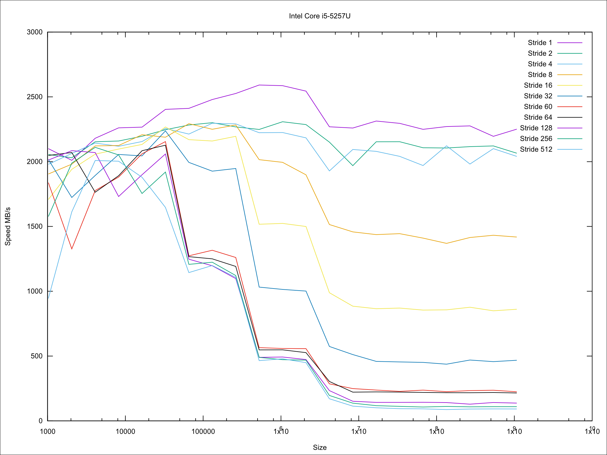

% Cache measurement
% Florian Mauracher `<florian.mauracher@tum.de>`
% Jonas Jelten `<jelten@in.tum.de>`

# what

* google benchmark suite
* https://github.com/google/benchmark

# cacheline size

``` cpp
const int size = state.range(0);
char* arr = new char[size]();
const int stride = state.range(1);
int x = 0, y = 0;

while (state.KeepRunning()) {
	for (int i = 0; i < size; i += stride) {
		benchmark::DoNotOptimize(x += arr[i]);
	}
}
```

# cacheline results


# easiest method

```
gcc '-###' -e -v -march=native $* /usr/include/stdlib.h 2>&1
```

# shuffling the memory blocks

``` cpp

union cacheline {
	cacheline *next;
	char dummydata[cacheline_size];
};

auto cachelines = std::make_unique<cacheline[]>(n);

std::vector<unsigned int> order;
std::iota(std::begin(order), std::end(order), 0);

std::random_device rd;
std::shuffle(order.begin(), order.end(), std::mt19937(rd()));

for (int i = 0; i < n; i++) {
	int next_idx = order[(i + 1) % n];
	cachelines[order[i]].next = &cachelines[next_idx];
}
```

# perform random accesses

``` cpp
while (state.KeepRunning()) {
	for (register int i = 0; i < accesses; i++) {
		current_cacheline = current_cacheline->next;
	}
}
```


